# Diseño de Gramáticas para Compiladores

## 1. Introducción

La gramática de un lenguaje de programación no solo define su sintaxis, sino que **moldea la estructura del AST** (Abstract Syntax Tree). Una gramática bien diseñada produce un AST que refleja naturalmente la semántica del lenguaje, simplificando la implementación de los visitors (typechecker, intérprete, compilador).

Este documento explora cómo el diseño de la gramática impacta directamente en la complejidad del código del compilador, usando como caso de estudio el acceso a arrays multidimensionales.

---

## 2. Teoría: Recursividad a la Izquierda

### 2.1 Definición

Una gramática es **recursiva a la izquierda** cuando el no-terminal del lado izquierdo de una producción aparece como el primer símbolo del lado derecho:

```
A → A α | β
```

Donde `α` y `β` son secuencias de símbolos terminales y no terminales.

### 2.2 Relación con Estructuras de Datos

La recursividad a la izquierda en la gramática produce naturalmente **estructuras de datos recursivas** (árboles). Esto es fundamental porque:

1. **Mapeo directo**: Cada nivel de recursión en la gramática corresponde a un nivel en el AST
2. **Patrones de recorrido**: Los visitors pueden usar recursión natural en lugar de iteración
3. **Semántica composicional**: El significado de un nodo se construye a partir del significado de sus hijos

### 2.3 PLY y Recursividad a la Izquierda

PLY (Python Lex-Yacc) soporta recursividad a la izquierda, a diferencia de algunos generadores de parsers LL. Esto nos permite escribir gramáticas más naturales para construcciones como:

- Expresiones aritméticas: `E → E + T | T`
- Acceso a arrays: `A → A [ E ] | ID`
- Llamadas a métodos: `M → M . ID | ID`

---

## 3. Caso de Estudio: Acceso a Arrays

### 3.1 El Problema

Consideremos el acceso a un array multidimensional: `matrix[1][2]`

Necesitamos:
1. Parsear la sintaxis
2. Verificar tipos (¿es `matrix` un array? ¿son los índices enteros?)
3. Calcular la dirección de memoria usando row-major

La pregunta es: **¿Cómo estructuramos el AST para facilitar estas tareas?**

### 3.2 Enfoque 1: Lista Plana de Índices

**Gramática:**
```bnf
E_ARITH : ID braces
braces  : braces LBRACE E RBRACE
        | LBRACE E RBRACE
        | ε
```

**AST generado para `matrix[1][2]`:**
```
VariableNode
  name: "matrix"
  access: [PrimitiveNode(1), PrimitiveNode(2)]
```

**Problema:** La lista `access` es una estructura plana que no refleja la naturaleza recursiva del acceso multidimensional.

### 3.3 Enfoque 2: Estructura Recursiva

**Gramática:**
```bnf
array_access : array_access LBRACE E RBRACE
             | ID LBRACE E RBRACE
             | ID
```

**AST generado para `matrix[1][2]`:**
```
ArrayAccessNode
  base: ArrayAccessNode
    base: VariableNode("matrix")
    index: PrimitiveNode(1)
  index: PrimitiveNode(2)
```

**Ventaja:** El AST es recursivo, reflejando directamente la estructura del cálculo.

---

## 4. Comparación Visual de ASTs

### 4.1 Acceso Simple: `arr[0]`

**Ambos enfoques producen resultados similares:**

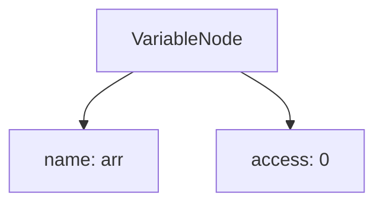

### 4.2 Acceso Doble: `matrix[1][2]`

**Enfoque 1 (Lista Plana):**

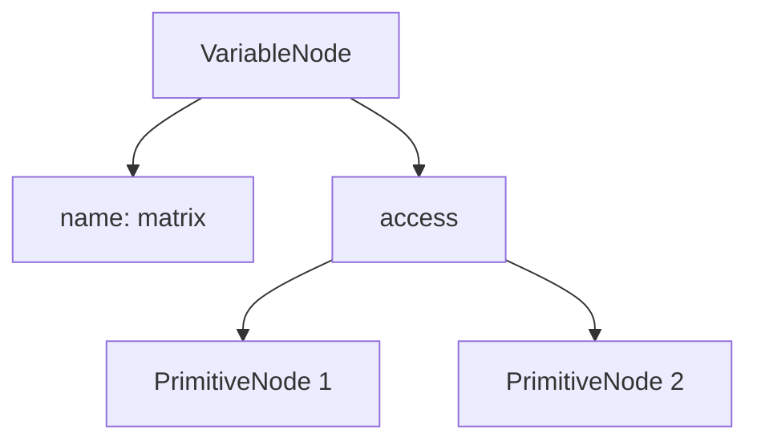

**Enfoque 2 (Recursivo):**

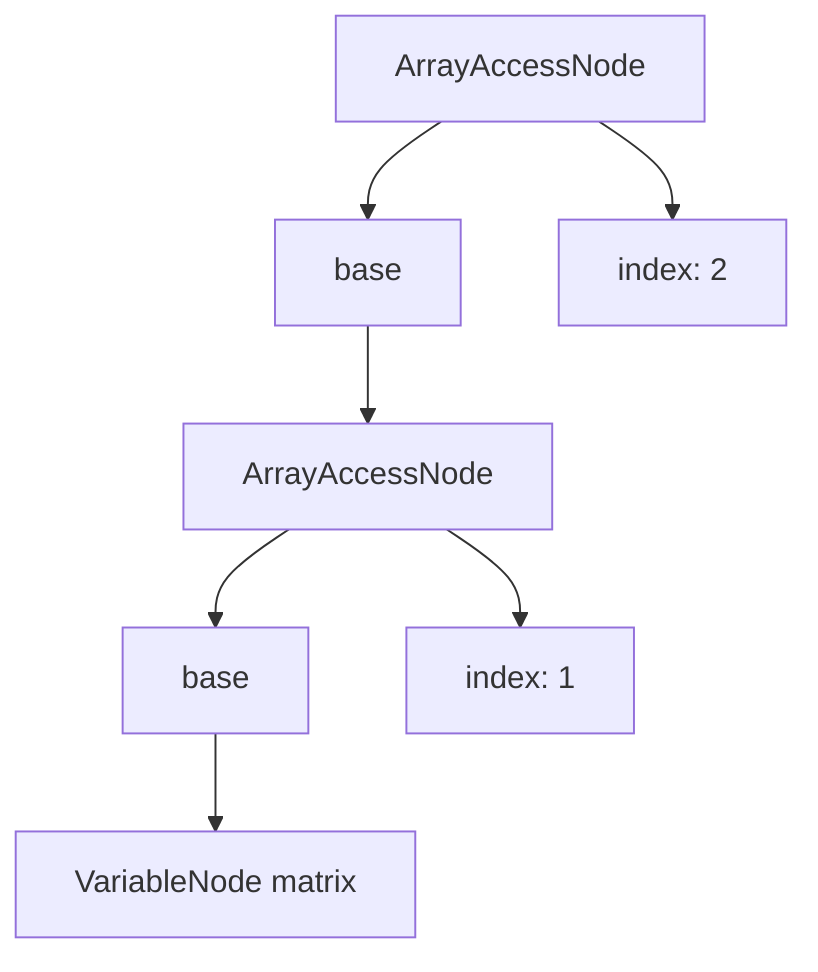

### 4.3 Acceso Triple: `cube[0][1][2]`

**Enfoque 1 (Lista Plana):**

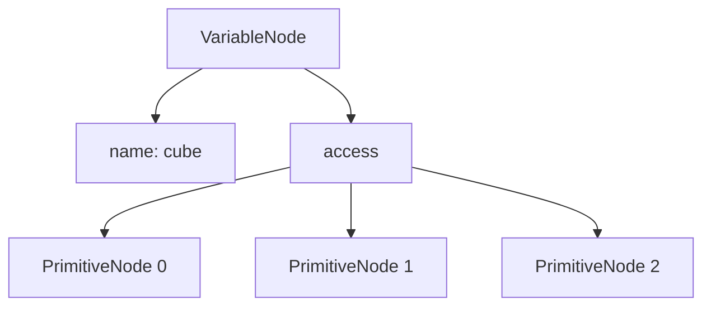

**Enfoque 2 (Recursivo):**

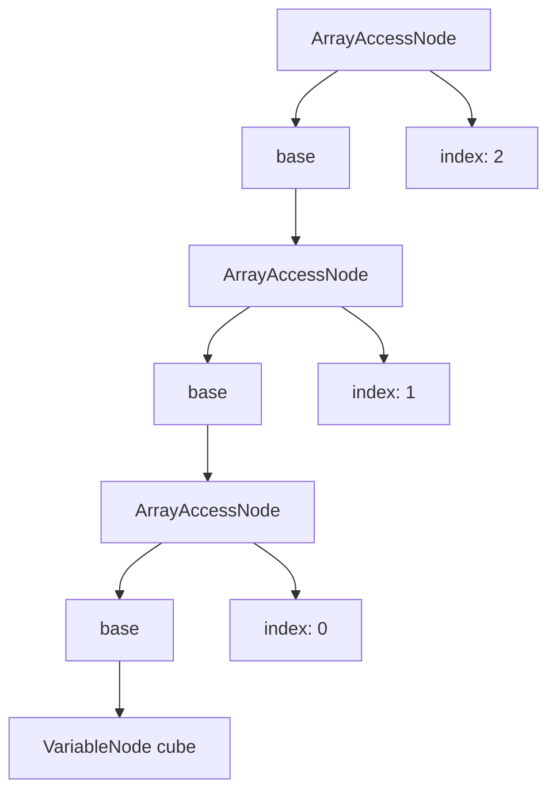

**Observación:** El enfoque recursivo crece en profundidad, mientras que el enfoque plano crece en anchura. La profundidad es más natural para el recorrido recursivo.

---

## 5. Impacto en los Visitors

### 5.1 TypeChecker

**Enfoque 1 (Iterativo):**
```python
def visit_variable(self, node: VariableNode):
    var_type = self.symbol_table.get_symbol(node.name)
    if var_type is None:
        self.error(f"Undefined variable: {node.name}", node)
        return None
    
    accessed_type = var_type
    for access in node.access:  # Iteración sobre lista
        index_type = self.dispatch(access)
        if index_type != "int":
            self.error(f"Array index must be int", node)
            return None
        if not isinstance(accessed_type, ArrayType):
            self.error(f"Variable is not an array", node)
            return None
        accessed_type = accessed_type.accessed_type(1)
    
    return accessed_type
```

**Enfoque 2 (Recursivo):**
```python
def visit_array_access(self, node: ArrayAccessNode):
    # Caso recursivo: procesar la base primero
    base_type = self.dispatch(node.base)
    
    if not isinstance(base_type, ArrayType):
        self.error(f"Cannot index non-array type", node)
        return None
    
    # Verificar que el índice sea entero
    index_type = self.dispatch(node.index)
    if index_type != "int":
        self.error(f"Array index must be int", node)
        return None
    
    # Retornar el tipo después de un nivel de acceso
    return base_type.accessed_type(1)
```

**Análisis:**
- El enfoque recursivo es más **composicional**: cada nodo se encarga de su propio nivel
- No hay bucles `for`, solo recursión natural
- Más fácil de razonar sobre la corrección

### 5.2 Compiler: Cálculo de Offsets

**La fórmula row-major:**
```
offset([i, j, k]) = offset([i, j]) * d_k + k
```

**Enfoque 1 (Función auxiliar):**
```python
def _calculate_array_offset(self, indices, shape):
    if len(indices) == 1:
        return self.dispatch(indices[0])
    
    partial_offset = self._calculate_array_offset(indices[:-1], shape[:-1])
    last_index = self.dispatch(indices[-1])
    dim_value = shape[-1]
    
    # Calcular: partial * dim + index
    dim_reg = self.builder.new_temp()
    self.builder.build_load_immediate(dim_reg, dim_value)
    
    temp_mul = self.builder.new_temp()
    self.builder.build_multiply(temp_mul, partial_offset, dim_reg)
    
    temp_add = self.builder.new_temp()
    self.builder.build_add(temp_add, temp_mul, last_index)
    
    return temp_add
```

**Enfoque 2 (Recursión directa en el visitor):**
```python
def visit_array_access(self, node: ArrayAccessNode):
    # Caso base: arr[i] donde base es VariableNode
    if not isinstance(node.base, ArrayAccessNode):
        return self.dispatch(node.index)
    
    # Caso recursivo: arr[i][j]
    partial_offset = self.visit_array_access(node.base)
    
    # Obtener la dimensión del nivel anterior
    base_type = self.type_checker.dispatch(node.base)
    dim_value = base_type.shape[-1]
    
    # Calcular: partial * dim + index
    dim_reg = self.builder.new_temp()
    self.builder.build_load_immediate(dim_reg, dim_value)
    
    index_reg = self.dispatch(node.index)
    
    temp_mul = self.builder.new_temp()
    self.builder.build_multiply(temp_mul, partial_offset, dim_reg)
    
    temp_add = self.builder.new_temp()
    self.builder.build_add(temp_add, temp_mul, index_reg)
    
    return temp_add
```

**Análisis:**
- El enfoque 2 **elimina la función auxiliar** `_calculate_array_offset`
- La recursión del AST mapea directamente a la recursión del cálculo
- No necesitamos pasar `shape` explícitamente; se obtiene del type checker

---

## 6. Mapeo entre Fórmula y AST

### 6.1 Fórmula Row-Major

Para un array con forma `(d₀, d₁, d₂)` y acceso `[i, j, k]`:

```
offset = i * (d₁ * d₂) + j * d₂ + k
```

Reescrito recursivamente:
```
offset([i, j, k]) = offset([i, j]) * d₂ + k
offset([i, j])    = offset([i]) * d₁ + j
offset([i])       = i
```

### 6.2 Correspondencia con el AST

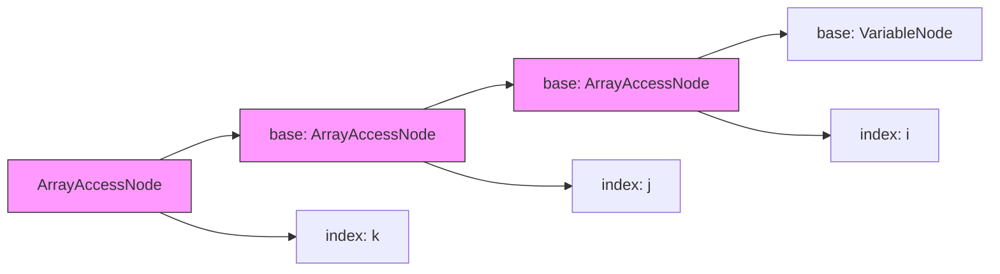

**Cada nodo `ArrayAccessNode` representa:**
```
offset_actual = offset_base * dimensión + índice_actual
     ↑                ↑            ↑
     |                |            |
  este nodo      node.base    node.index
```

### 6.3 Recorrido del Visitor

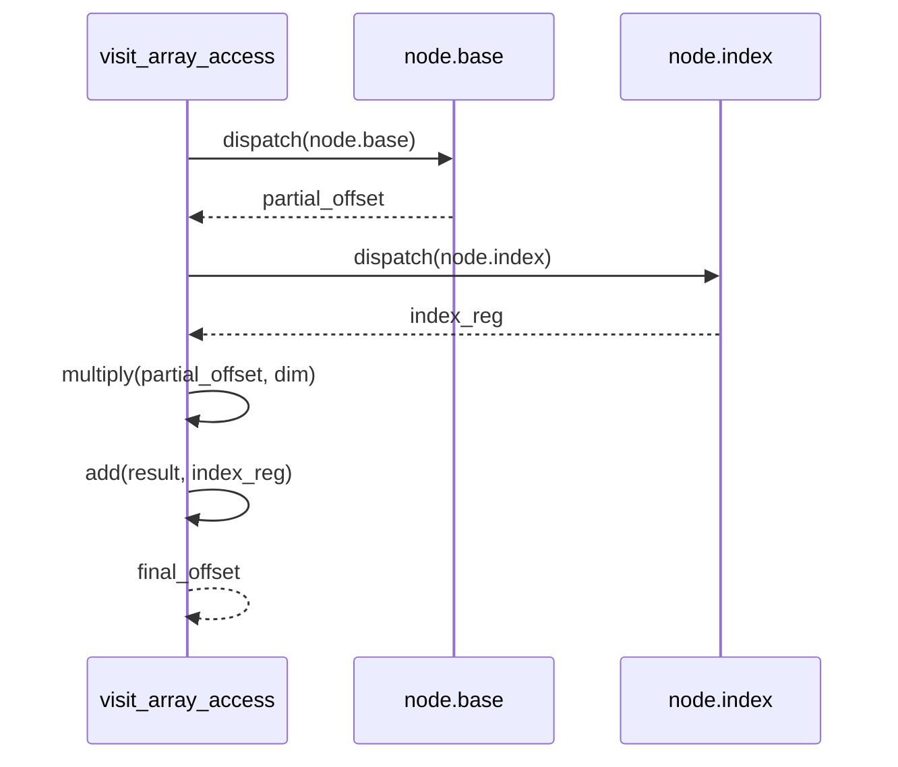

---

## 7. Caso de Estudio 2: Literales de Arrays Recursivos

### 7.1 El Problema de los Literales

Consideremos la declaración de un array: `int arr = [1, 2, 3, 4, 5]`

Necesitamos:
1. Validar que todos los elementos sean del mismo tipo
2. Calcular las dimensiones del array
3. Determinar la longitud total
4. Detectar errores de tipo lo antes posible (fail-fast)

### 7.2 Enfoque 1: Lista Plana

**Gramática actual:**
```bnf
array : array COMMA E
      | E
```

**AST generado para `[1, 2, 3]`:**
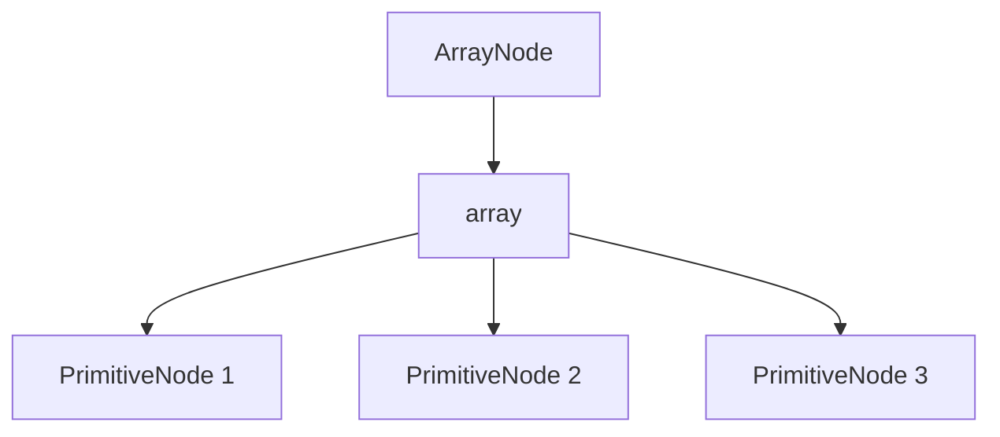

**Problema:** La lista plana requiere procesar todos los elementos antes de poder validar tipos o calcular dimensiones.

### 7.3 Enfoque 2: Estructura Recursiva

**Gramática recursiva:**
```bnf
array_exp : array_exp COMMA E
          | LBRACE E RBRACE
```

**AST generado para `[1, 2, 3]`:**
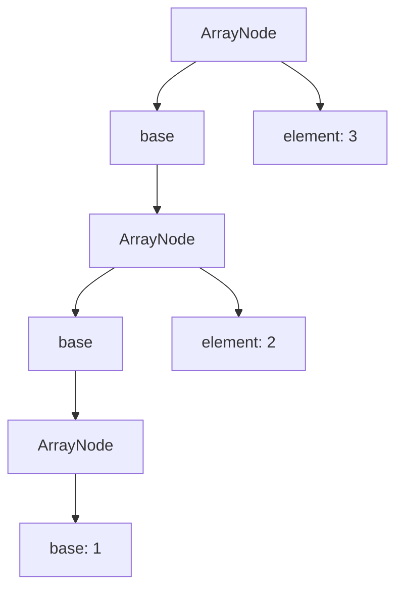

**Ventaja:** El AST es recursivo, permitiendo procesamiento incremental.

### 7.4 Cálculo Recursivo de Dimensiones

Con la gramática recursiva, podemos calcular dimensiones de forma natural:

```python
def visit_array(self, node: ArrayNode):
    # Caso base: primer elemento
    if not isinstance(node.base, ArrayNode):
        element_type = self.dispatch(node.base)
        return {
            "type": element_type,
            "dimensions": 1,
            "length": 1,
            "shape": (1,)
        }
    
    # Caso recursivo: procesar base primero
    base_info = self.visit_array(node.base)
    
    # Validar tipo del elemento actual
    element_type = self.dispatch(node.element)
    if element_type != base_info["type"]:
        raise CompilerError(f"Type mismatch in array: expected {base_info['type']}, got {element_type}")
    
    # Incrementar longitud
    return {
        "type": base_info["type"],
        "dimensions": base_info["dimensions"],
        "length": base_info["length"] + 1,
        "shape": (base_info["length"] + 1,)
    }
```

### 7.5 Fail-Fast en Validación de Tipos

**Ejemplo:** `[1, 2, "error", 4]`

**Enfoque iterativo (lista plana):**
```python
def visit_array(self, node: ArrayNode):
    element_types = []
    for elem in node.array:
        # Procesa TODOS los elementos
        element_types.append(self.dispatch(elem))
    
    # Valida tipos después de procesar todo
    if not all(t == element_types[0] for t in element_types):
        raise CompilerError("Type mismatch")
```

**Problema:** Procesa el `4` incluso aunque ya detectó el error en `"error"`.

**Enfoque recursivo:**
```python
def visit_array(self, node: ArrayNode):
    # Caso base
    if not isinstance(node.base, ArrayNode):
        return self.dispatch(node.base)
    
    # Procesar base primero
    base_type = self.visit_array(node.base)
    
    # Si la base ya tiene error, no procesamos element
    if base_type == ERROR:
        return ERROR
    
    # Validar solo este elemento
    element_type = self.dispatch(node.element)
    if element_type != base_type:
        return ERROR  # Fail-fast: no procesamos más
    
    return base_type
```

**Ventaja:** Si detectamos error en posición 3, no procesamos el elemento 4.

### 7.6 Construcción Incremental del Offset

**Enfoque iterativo:**
```python
def visit_array(self, node: ArrayNode):
    first_offset = None
    for elem in node.array:
        offset = self.builder.emit_alloca(...)
        self.builder.build_memory_store(elem.value, offset)
        if first_offset is None:
            first_offset = offset
    return first_offset
```

**Enfoque recursivo:**
```python
def visit_array(self, node: ArrayNode):
    # Caso base: primer elemento
    if not isinstance(node.base, ArrayNode):
        offset = self.builder.emit_alloca("arr_0", element_type)
        self.builder.build_memory_store(node.base.value, offset)
        return offset  # Offset del primer elemento
    
    # Procesar base recursivamente
    base_offset = self.visit_array(node.base)
    
    # Agregar este elemento al final
    current_offset = self.builder.emit_alloca(f"arr_{current_index}", element_type)
    self.builder.build_memory_store(node.element.value, current_offset)
    
    # Retornar el offset del primer elemento (no cambia)
    return base_offset
```

**Ventaja:** El offset base se construye una sola vez y se propaga hacia arriba.

### 7.7 Simetría entre Literales y Acceso

Con gramáticas recursivas para ambos, obtenemos una simetría elegante:

**Literal recursivo:**
```bnf
array_exp : array_exp COMMA E
          | LBRACE E RBRACE
```

**Acceso recursivo:**
```bnf
array_access : array_access LBRACE E RBRACE
             | ID LBRACE E RBRACE
             | ID
```

**ASTs simétricos:**

Literal `[1, 2, 3]`:
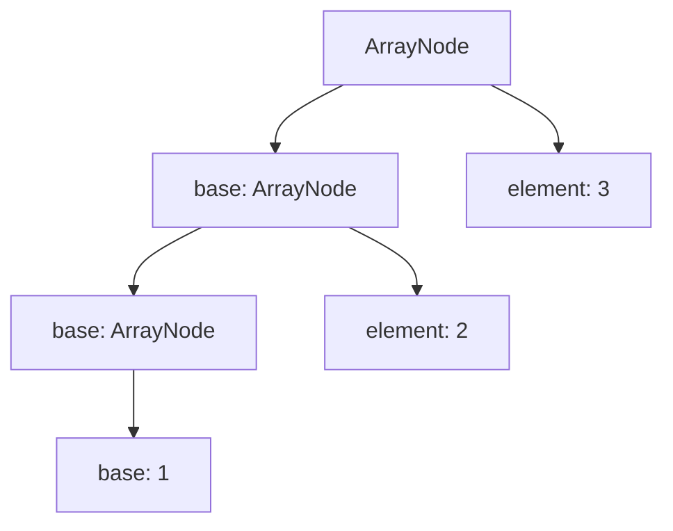

Acceso `arr[0][1][2]`:
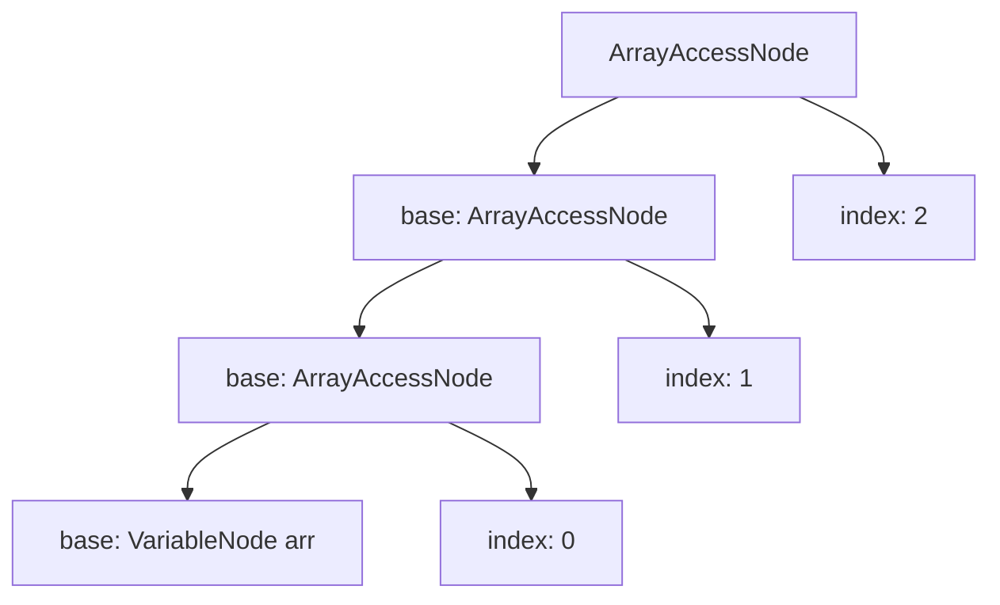

**Observación:** Ambos usan el mismo patrón recursivo, haciendo el diseño más coherente.

### 7.8 Cálculo de Dimensiones para Arrays Multidimensionales

Para `[[1, 2, 3], [4, 5, 6]]`:

**Enfoque recursivo:**
```python
def visit_array(self, node: ArrayNode):
    # Caso base: array 1D
    if not isinstance(node.base, ArrayNode):
        element_type = self.dispatch(node.base)
        return {
            "type": element_type,
            "dimensions": 1,
            "shape": (1,)
        }
    
    # Caso recursivo
    base_info = self.visit_array(node.base)
    
    # Si es array de arrays, calcular dimensiones superiores
    if isinstance(node.element, ArrayNode):
        element_info = self.visit_array(node.element)
        
        # Validar que todas las sub-arrays tengan la misma forma
        if base_info["shape"] != element_info["shape"]:
            raise CompilerError("Inconsistent array dimensions")
        
        return {
            "type": element_info["type"],
            "dimensions": base_info["dimensions"] + 1,
            "shape": (2, *element_info["shape"])  # 2 filas, shape de columna
        }
```

**Ventaja:** Las dimensiones se calculan naturalmente durante el recorrido recursivo.

### 7.9 Comparación de Complejidad

| Aspecto | Lista Plana | Recursivo |
|---------|-------------|-----------|
| **Validación de tipos** | Procesa todos, luego valida | Fail-fast en cada paso |
| **Cálculo de dimensiones** | Iteración posterior | Cálculo incremental |
| **Construcción de offset** | Bucle + condición | Recursión natural |
| **Detección de errores** | Después de procesar todo | Inmediata |
| **Consistencia del diseño** | Diferente del acceso | Simétrico con acceso |

### 7.10 Consideraciones Prácticas

**Ventajas:**
- Fail-fast en validación de tipos
- Construcción incremental de offsets
- Simetría con el acceso a arrays
- Cálculo natural de dimensiones

**Desventajas:**
- AST más profundo (O(n) vs O(1))
- Posible límite de recursión en Python para arrays muy grandes
- Menos eficiente en memoria para arrays grandes

---

## 8. Principios de Diseño de Gramáticas

### 8.1 Principio 1: Piensa en el AST, no solo en la Sintaxis

**Mal diseño:**
```bnf
stmt : ID EQUALS expr
expr : expr PLUS term | term
```

Esto produce un AST plano para `a + b + c`:
```
ArithOpNode
  left: ArithOpNode(a, +, b)
  op: +
  right: c
```

**Buen diseño:**
Considera la asociatividad y precedencia desde el inicio:
```bnf
expr   : expr PLUS term | term
term   : term TIMES factor | factor
factor : NUM | ID | LPAREN expr RPAREN
```

### 8.2 Principio 2: Usa Recursividad para Estructuras Anidadas

Cuando la semántica es recursiva, la gramática y el AST deben serlo también.

**Ejemplo: Llamadas a métodos encadenadas**
```java
obj.method1().method2().method3()
```

**Gramática recursiva:**
```bnf
method_call : method_call DOT ID LPAREN args RPAREN
            | ID DOT ID LPAREN args RPAREN
            | ID LPAREN args RPAREN
```

**AST recursivo:**
```
MethodCallNode
  receiver: MethodCallNode
    receiver: MethodCallNode
      receiver: VariableNode(obj)
      method: method1
    method: method2
  method: method3
```

### 8.3 Principio 3: Cada Nivel de Recursión = Un Nivel Semántico

**Mal diseño:**
```bnf
access : ID LBRACE expr_list RBRACE
expr_list : expr_list COMMA expr 
    | expr
```

Problema: `expr_list` es una lista plana, pero el acceso a arrays es recursivo.

**Buen diseño:**
```bnf
access : access LBRACE expr RBRACE
       | ID LBRACE expr RBRACE
       | ID
```

Cada nivel de `access` corresponde a un nivel de indirection.

### 8.4 Principio 4: Evita Listas Planas cuando la Semántica es Recursiva

**Pregunta clave:** ¿El procesamiento de esta construcción requiere iteración o recursión?

- Si la respuesta es **recursión**, usa gramática recursiva
- Si la respuesta es **iteración**, una lista plana está bien

**Ejemplo: Parámetros de función**
```bnf
params : params COMMA param 
    | param
```

Aquí una lista plana está bien, porque los parámetros se procesan secuencialmente, no recursivamente.

**Ejemplo: Acceso a arrays**
```bnf
access : access LBRACE expr RBRACE 
       | ID LBRACE expr RBRACE 
       | ID
```

Aquí la recursión es necesaria, porque cada nivel de acceso depende del resultado del nivel anterior.

---

## 9. Ejemplo Completo: Refactorización

### 9.1 Antes: Gramática con Lista Plana

**Gramática:**
```bnf
E_ARITH : ID braces
braces  : braces LBRACE E RBRACE
        | LBRACE E RBRACE
        | ε
```

**Nodo AST:**
```python
class VariableNode(Node):
    def __init__(self, name, access, lineno=None):
        self.name = name
        self.access = access  # Lista de índices
```

**Visitor (Compiler):**
```python
def visit_variable(self, node: VariableNode):
    if node.access:
        offset = self._calculate_array_offset(node.access, shape)
        # ... cargar valor usando offset
    else:
        # ... cargar variable simple
```

**Función auxiliar:**
```python
def _calculate_array_offset(self, indices, shape):
    # Recursión sobre lista plana
    if len(indices) == 1:
        return self.dispatch(indices[0])
    partial = self._calculate_array_offset(indices[:-1], shape[:-1])
    # ... calcular partial * shape[-1] + indices[-1]
```

### 9.2 Después: Gramática Recursiva

**Gramática:**
```bnf
array_access : array_access LBRACE E RBRACE
             | ID LBRACE E RBRACE
             | ID
```

**Nodo AST:**
```python
class ArrayAccessNode(Node):
    def __init__(self, base, index, lineno=None):
        self.base = base    # VariableNode o ArrayAccessNode
        self.index = index  # Expresión del índice
```

**Visitor (Compiler):**
```python
def visit_array_access(self, node: ArrayAccessNode):
    # Caso base
    if not isinstance(node.base, ArrayAccessNode):
        return self.dispatch(node.index)
    
    # Caso recursivo
    partial_offset = self.visit_array_access(node.base)
    # ... calcular partial_offset * dim + node.index
```

**Sin función auxiliar:** La recursión está en el visitor, no en una función separada.

### 9.3 Comparación de Complejidad

| Aspecto | Antes (Lista Plana) | Después (Recursivo) |
|---------|---------------------|---------------------|
| **Funciones auxiliares** | `_calculate_array_offset` | Ninguna |
| **Patrón de recorrido** | Iteración + recursión | Solo recursión |
| **Líneas de código** | ~50 líneas | ~30 líneas |
| **Complejidad cognitiva** | Media | Baja |
| **Facilidad de extensión** | Difícil | Fácil |

---

## 10. Conclusión

### 10.1 Una Gramática Bien Diseñada

1. **Reduce código en los visitors**: Elimina funciones auxiliares y bucles
2. **Hace el código más mantenible**: Patrones recursivos son más fáciles de razonar
3. **Refleja la semántica del lenguaje**: La estructura del AST mapea directamente al significado
4. **Facilita la extensión**: Agregar nuevas construcciones es más natural

### 10.2 Preguntas Clave al Diseñar una Gramática

1. **¿Cuál es la semántica de esta construcción?**
   - ¿Es recursiva o iterativa?
   - ¿Cada nivel depende del resultado del anterior?

2. **¿Cómo se verá el AST?**
   - ¿Será plano o recursivo?
   - ¿Refleja la estructura del cálculo?

3. **¿Cómo lo procesarán los visitors?**
   - ¿Usarán recursión o iteración?
   - ¿Necesitarán funciones auxiliares?

### 10.3 Regla de Oro

> **Si la semántica es recursiva, la gramática y el AST deben ser recursivos también.**

Una gramática que produce un AST que no refleja la semántica del lenguaje es una gramática mal diseñada, aunque sea sintácticamente correcta.

---

## 11. Referencias

- Aho, A. V., Lam, M. S., Sethi, R., & Ullman, J. D. (2006). *Compilers: Principles, Techniques, and Tools* (2nd ed.). Addison-Wesley.
